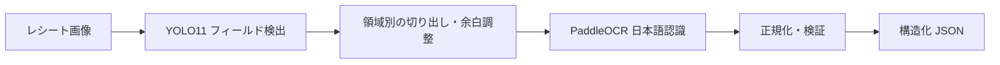

# 日本語レシート管理 2.0 — YOLO11 + PaddleOCR

[English](README.md) | [日本語](README.ja.md)

日本のコンビニレシートから重要フィールドを検出し、検出領域だけに OCR を適用して、構造化 JSON を返すエンドツーエンドの Document AI プロトタイプです。

## 2.0 — ローカルレシート管理（MVP）

1.0 の実装は `v1.0-baseline-1135fa1`、2.0 は `v2.0.0` タグで保持します。
モデル配布の既存リリース `v1.0.0` は引き続き利用します。
[リリースノート](docs/releases/v2.0.0.md)・[操作手順](docs/manager-walkthrough.md)も参照してください。

日付領域のみ、文書全体向けの向き補正・歪み補正を無効にしました。過去の失敗39画像
（元レシート23枚）では39件が画像の目視読取りと一致しました。ただしCodexによる
読取りであり、独立した正解検証や全体精度の評価ではありません。
[診断の条件と結果](docs/date-crop-diagnostic.md)を公開しています。

補助認識の判定対象は店名・日付・合計金額のみです。商品明細の欠落・対応不明・明細合計の差額は参考表示に留め、呼出し条件にしません。
画像入力対応の Chat Completions アダプターと「让 AI 辅助核对」ボタンを追加しました。
ローカルで設定後、確認が必要な項目に対して利用者が明示的に実行します。
提案は元の OCR・手動修正値と別に保持し、自動再送は行いません。失敗後は費用表示付きボタンで手動再試行でき、画像ごとに最大3回までの履歴を保持します。
呼出し結果、処理時間、token 数、設定単価に基づく概算費用を SQLite に記録します。
テストでは模擬応答を使用しており、実際のモデル API での検証は未実施です。
[設定・制約（中国語）](docs/multimodal-setup.md)をご覧ください。
詳細は [認識ルールと評価手順](docs/hybrid-recognition.md) を参照してください。

サイドバーに「1.0 · 识别实验室」と「2.0 · 票据管理」の2画面を用意しました。
既存の検出・切り出し・OCR・JSON表示を残し、確認・修正・保存・検索・CSV出力を追加しています。
画面操作時はセッション内の認識結果を再利用し、OCRを繰り返し実行しません。

画像、元のOCR結果、修正後の値、変更履歴は `.receipt_library/receipts.sqlite3` に保存します。
このディレクトリはGit管理対象外です。`RECEIPT_LIBRARY_DIR` で保存先を変更できます。
金額は整数の日本円です。現在はローカル・単一ユーザー向けで、クラウド同期は未実装です。
商品名と行金額の候補を表形式で確認・修正・保存できます。対応が曖昧なOCR文字列は
手動確認用に残し、数量・単価・税率・値引きは推測しません。商品行の合計とレシート合計の
差額を表示し、商品明細CSVも出力できます。一致しても認識精度を保証するものではありません。
「批量处理」では最大10枚（各10 MB以下）を順次認識できます。失敗した画像だけ再試行し、
成功結果は個別に確認、または未確認のまま一括保存できます。同一画像の重複保存を防止します。
キューはセッション内のみ保持されるため、再読み込み・終了前に結果を保存してください。
以下の評価指標・デモは1.0の成果として保持しています。起動コマンドは変更ありません。


## 2.0 管理画面


画面説明用の架空データです。OCR精度の実例ではありません。

## 1.0 認識デモ


レシートのアップロード、領域検出、切り出し、日本語 OCR、値の正規化、JSON 出力までを確認できます。

## システム構成

レシート全体への OCR は、小さい文字、店舗ごとのレイアウト差、傾き、撮影ノイズの影響を受けやすいため、本システムは業務上重要な領域を先に検出します。



検出対象は `store_name`、`date`、`total_amount`、`items_area` の4領域です。

## 評価結果

独自データセットを用い、画像サイズ 640、80 Epoch で学習しました。同一レシートの画像は必ず同じ Split に保持し、類似画像によるデータリークを防止しています。掲載指標の Validation Split は、元レシート8枚・画像23枚です。

| 指標 | Validation 結果 |
|---|---:|
| Precision | 0.903 |
| Recall | 0.913 |
| mAP50 | 0.892 |
| mAP50–95 | 0.523 |

mAP50 と mAP50–95 の差から、対象領域の検出は比較的安定している一方、厳しい IoU 条件での Box 位置精度には改善余地があります。OCR は正解ラベルが未整備のため、現時点では定量精度を主張していません。


## データセット

| 項目 | 値 |
|---|---:|
| 元レシート | 65 枚 |
| 画像 | 193 枚 |
| 1レシートあたり | 最大3方向 |
| 店舗チェーン | 4社 |
| 検出クラス | 4 |
| Annotation | 手動 Bounding Box |

FamilyMart、LAWSON、7-Eleven、MyBasket を対象としています。`src/split_yolo_dataset_by_receipt.py` は元レシート単位で Grouping し、店舗別に Train / Validation / Test を作成します。個人情報・購買情報を含む可能性があるため、レシート原画像は GitHub に公開していません。

## 実行方法

Python 3.11 または 3.12 を推奨します。

```bash
git clone https://github.com/taojiangyz/receipt-yolo11-ocr.git
cd receipt-yolo11-ocr
python -m venv .venv
source .venv/bin/activate
pip install -r requirements.txt
python download_model.py
streamlit run streamlit_app.py
```

Weight は SHA256 を確認した上で `models/best.pt` に保存されます。別の Weight は `RECEIPT_MODEL_PATH` で指定できます。

## 実装上の判断

| 課題 | 対応 |
|---|---|
| 類似画像のリーク | 画像単位ではなく元レシート単位で分割 |
| 合計金額の切り欠け | `total_amount` の右・下 Padding を拡大 |
| 日本語 OCR の不安定さ | EasyOCR / Tesseract / PaddleOCR を比較し PaddleOCR を採用 |
| PyTorch / Paddle の競合 | YOLO を先に実行し PaddleOCR を遅延初期化 |
| 誤った合計金額のリスク | 未検証値を無理に返さず空値を優先 |
| 再現性 | 依存関係、Weight、Split Code、指標、Demo を公開 |

## 現在の制約

- 元レシートは65枚であり、店舗・端末・照明・レイアウトの多様性を増やす必要があります。
- OCR の Field Exact Match や Character Error Rate はまだ計測していません。
- 合計金額には Confidence Calibration と強い Validation が必要です。
- 商品名・行金額は保守的な候補抽出のみで、数量・単価・税率・値引きの推測は未実装です。
- 日付の強調再認識で得た候補は必ず確認対象です。画像 API アダプターは実装済みですが、実モデルによる精度検証は未完了です。
- Streamlit はローカル MVP であり、認証・監視・Cloud Deployment は未実装です。

次の評価では、レシート単位の Hold-out Test に対して Field Exact Match、Character Error Rate、合計金額精度、End-to-End Latency を測定します。

## ライセンス

Source Code は [MIT License](LICENSE) で公開しています。モデル Weight は Portfolio / Research Demo 用です。レシート原画像と第三者 Trademark は Software License の対象外です。
