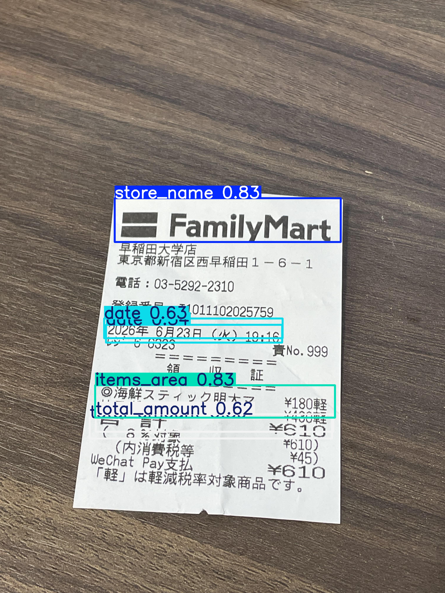
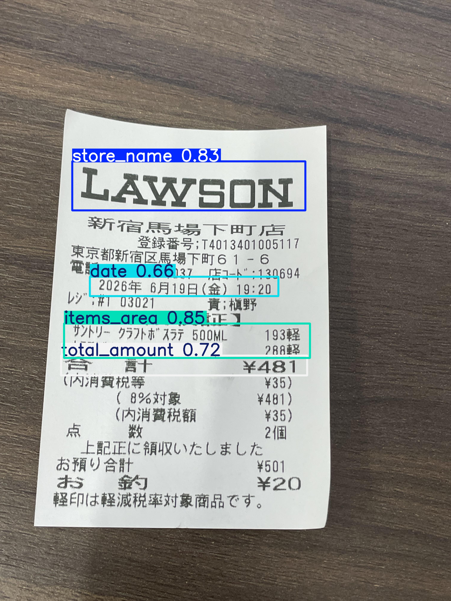
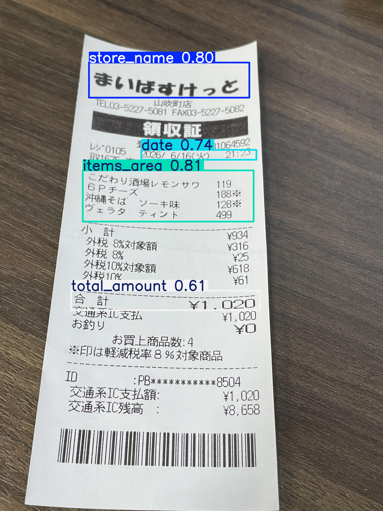
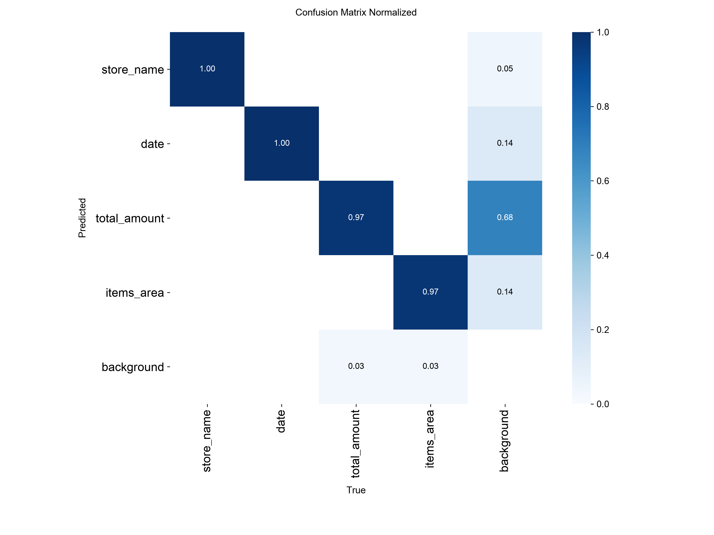
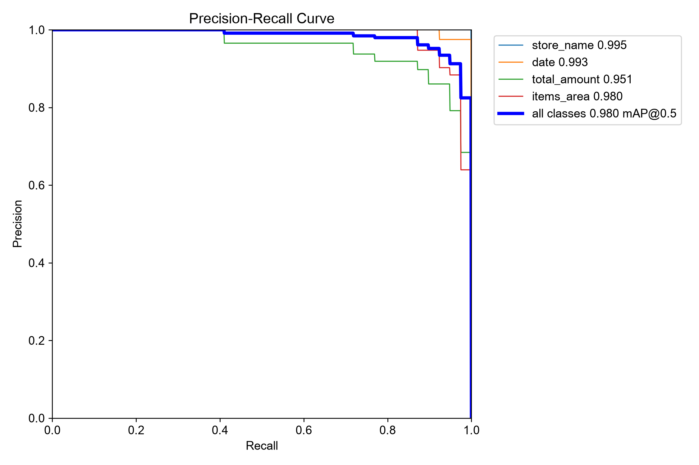
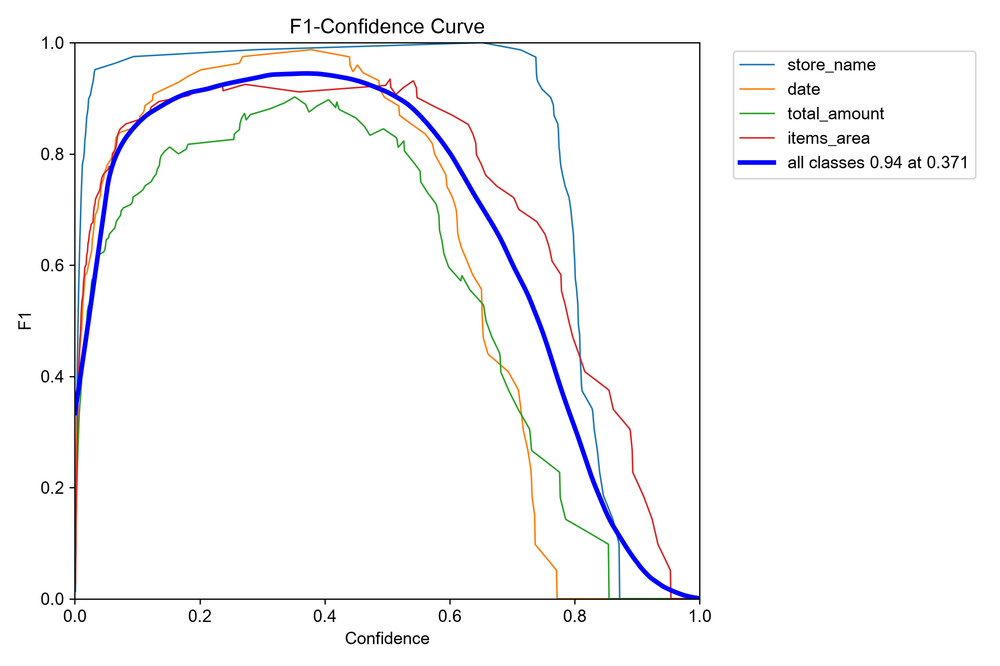
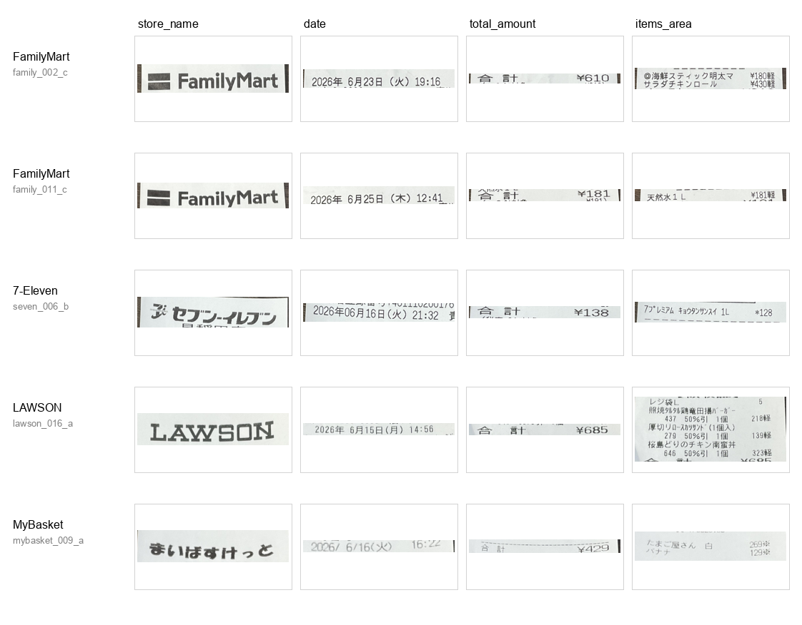

# Receipt YOLO11 OCR Project  
# レシートYOLO11 OCRプロジェクト

This project detects key layout regions from Japanese convenience store receipts using YOLO11.  
The goal is to improve receipt OCR by first detecting important regions, instead of applying OCR to the entire receipt image directly.

本プロジェクトは、YOLO11を用いて日本のコンビニレシート画像から重要なレイアウト領域を検出するプロジェクトです。  
レシート画像全体に直接OCRを適用するのではなく、先に重要領域を検出することで、OCR精度の改善を目指しています。

---

## Project Overview  
## プロジェクト概要

Receipt images often contain many small text lines, different layouts, background noise, and tilted photos.  
Direct OCR on the whole receipt can be unstable.

レシート画像には、小さな文字、店舗ごとの異なるレイアウト、背景ノイズ、傾きなどが含まれます。  
そのため、画像全体に直接OCRをかけると、認識結果が不安定になることがあります。

Therefore, this project uses object detection as a preprocessing step before OCR.

そのため、本プロジェクトではOCRの前処理として物体検出を使用しています。

The model detects the following receipt regions:

検出対象のレシート領域は以下の通りです。

- `store_name`
- `date`
- `total_amount`
- `items_area`

After these regions are detected, each region can be cropped and passed to OCR separately.

これらの領域を検出した後、それぞれの領域を切り出し、個別にOCRへ入力します。

---

## Pipeline  
## パイプライン

1. Collect Japanese convenience store receipt images  
   日本のコンビニレシート画像を収集

2. Annotate key receipt regions with bounding boxes  
   重要領域にバウンディングボックスを付与

3. Train a YOLO11 object detection model  
   YOLO11物体検出モデルを学習

4. Evaluate the model using validation images  
   検証画像でモデルを評価

5. Compare predicted bounding boxes with manual labels  
   予測されたバウンディングボックスと手動ラベルを比較

6. Crop detected regions  
   検出領域を切り出し

7. Apply OCR to extract text  
   OCRを適用して文字情報を抽出

8. Output structured receipt information  
   構造化されたレシート情報を出力

---

## Model  
## モデル

- Model: YOLO11  
- Task: Object Detection  
- Input image size: 640  
- Classes:
  - `store_name`
  - `date`
  - `total_amount`
  - `items_area`

- モデル：YOLO11  
- タスク：物体検出  
- 入力画像サイズ：640  
- クラス：
  - `store_name`
  - `date`
  - `total_amount`
  - `items_area`

---

## Data Collection  
## データ収集

This project uses a small custom dataset of Japanese convenience store receipt images collected by myself.

本プロジェクトでは、自分で収集した日本のコンビニレシート画像の小規模カスタムデータセットを使用しています。

The dataset includes receipts from multiple Japanese convenience store chains, such as FamilyMart, LAWSON, 7-Eleven, and MyBasket.

データセットには、FamilyMart、LAWSON、7-Eleven、MyBasketなど、複数の日本のコンビニチェーンのレシートが含まれています。

Receipt photos were taken under different conditions, including different angles, distances, lighting conditions, and receipt layouts.

レシート画像は、異なる角度、距離、照明条件、レイアウトを含む複数の条件で撮影しました。

The following key regions were manually annotated with bounding boxes:

以下の重要領域に対して、手動でバウンディングボックスを付与しました。

- `store_name`
- `date`
- `total_amount`
- `items_area`

The annotations were converted into YOLO format for object detection training.

アノテーションは、物体検出モデルの学習に使用するため、YOLO形式に変換しました。

---

## Training and Inference  
## 学習と推論

A YOLO11 object detection model was trained to detect key receipt regions.

YOLO11物体検出モデルを学習し、レシート内の重要領域を検出できるようにしました。

The model was trained with an input image size of 640 and four detection classes.

モデルは入力画像サイズ640、4つの検出クラスで学習しました。

During inference, the trained YOLO11 model predicts bounding boxes for each receipt image.  
The prediction script then selects detected regions, crops them, and saves each cropped field for OCR.

推論時には、学習済みYOLO11モデルが各レシート画像に対してバウンディングボックスを予測します。  
その後、推論スクリプトが検出領域を切り出し、OCR用のフィールド画像として保存します。

The cropped fields are saved under:

切り出されたフィールド画像は以下に保存されます。

```text
outputs/crops/
```

The cropped regions are then passed to PaddleOCR for text extraction and JSON output.

その後、切り出された領域をPaddleOCRに渡し、文字認識とJSON出力を行います。

---

## Model Evaluation  
## モデル評価

The YOLO11 model was evaluated using validation images.

YOLO11モデルは検証用画像を用いて評価しました。

The final training epoch produced the following validation metrics:

最終エポックでは、以下の検証指標が得られました。

| Metric | Value |
|---|---:|
| Precision | 0.903 |
| Recall | 0.913 |
| mAP50 | 0.892 |
| mAP50-95 | 0.523 |

These results show that the model can detect key receipt regions with reasonably high precision and recall.

これらの結果から、モデルはレシート内の重要領域を比較的高い適合率と再現率で検出できていることが分かります。

In addition to numerical metrics, qualitative evaluation was also performed by comparing predicted bounding boxes with manual annotations.

数値指標に加えて、予測されたバウンディングボックスと手動アノテーションを比較する定性的評価も行いました。

For this project, detection quality is especially important because OCR accuracy depends heavily on whether the correct receipt regions are cropped.

本プロジェクトでは、OCR精度が正しい領域切り出しに大きく依存するため、検出品質が特に重要です。

---

## Qualitative Evaluation Examples  
## 定性的評価例

The following examples show YOLO11 predictions on Japanese convenience store receipt images.  
The model detects key receipt regions such as store name, date, total amount, and item area.

### FamilyMart Example



### Lawson Example



### MyBasket Example



## Evaluation Results  
## 評価結果

### Normalized Confusion Matrix



### Precision-Recall Curve



### F1 Curve



## OCR and JSON Output  
## OCRとJSON出力

The project has been extended from YOLO11 detection-only to an end-to-end receipt OCR pipeline.

本プロジェクトは、YOLO11による領域検出だけでなく、OCRとJSON出力まで含むエンドツーエンドのレシート認識パイプラインに拡張されています。

After YOLO11 detects key receipt regions, each region is cropped and passed to OCR separately.  
The current MVP uses PaddleOCR as the main OCR engine for Japanese receipt text.

YOLO11で重要領域を検出した後、それぞれの領域を切り出して個別にOCRを適用します。  
現在のMVPでは、日本語レシート文字認識の主OCRエンジンとしてPaddleOCRを使用しています。

Current OCR pipeline:

現在のOCRパイプライン：

```text
Receipt image
→ YOLO11 region detection
→ Cropped receipt fields
→ PaddleOCR text extraction
→ Post-processing
→ Structured JSON output
```

The OCR pipeline extracts the following fields:

OCRパイプラインでは、以下のフィールドを抽出します。

- `store_name`
- `date`
- `total_amount`
- `items_text`

The `items_area` region is currently exported as raw OCR text.  
Item-level structured parsing, such as separating each product name, price, quantity, discount, and tax category, is not included in the MVP version.

現在、`items_area` 領域はOCR結果の生テキストとして出力します。  
商品名、価格、数量、割引、税区分などを商品ごとに構造化する処理は、MVP版には含めていません。

## Why PaddleOCR?  
## PaddleOCRを選択した理由

EasyOCR was first used as the baseline OCR engine to build the initial end-to-end pipeline.

最初はEasyOCRをベースラインOCRエンジンとして使用し、検出、切り出し、OCR、JSON出力までの初期パイプラインを構築しました。

However, after error analysis, EasyOCR was found to be unstable for Japanese receipt amounts and store logos.  
The `total_amount` field was especially difficult, with missing or incorrect values.

しかし、エラー分析の結果、EasyOCRは日本語レシートの金額欄や店舗ロゴの認識が不安定であることが分かりました。  
特に `total_amount` は、読み落としや誤認識が発生しやすいフィールドでした。

PaddleOCR was then tested on the same YOLO-cropped receipt regions.  
It produced better results for store name, date, total amount, and item text.

その後、同じYOLO切り出し領域に対してPaddleOCRをテストしました。  
その結果、店舗名、日付、合計金額、商品明細テキストにおいて、PaddleOCRの方がより良い結果を示しました。

Therefore, PaddleOCR was selected as the main OCR engine for the MVP, while EasyOCR and Tesseract are kept as baseline experiments for comparison and error analysis.

そのため、MVPではPaddleOCRを主OCRエンジンとして採用し、EasyOCRとTesseractは比較実験およびエラー分析用のベースラインとして残しています。

## Example OCR Command  
## OCR実行例

Run PaddleOCR on cropped receipt regions:

切り出されたレシート領域に対してPaddleOCRを実行します。

```bash
python3 src/ocr_receipt_paddle.py --crop_dir outputs/crops/family_002_c
```

Example JSON output:

JSON出力例：

```json
{
  "image_id": "family_002_c",
  "ocr_engine": "PaddleOCR",
  "store_name_raw": "FamilyMart",
  "store_name_candidate": "FamilyMart",
  "date_raw": "2026年6月23日（火）19:16",
  "date_candidate": "2026-06-23",
  "total_amount_raw": "¥610\n合計",
  "total_amount_candidate": "610",
  "items_text": "海鮮スティック明太マ\n¥180軽\nサラダチキンロール\n¥430軽"
}
```

## Demo Samples  
## デモサンプル

The final demo samples cover multiple Japanese convenience store chains and different receipt layouts.

最終デモサンプルは、複数の日本のコンビニチェーンと異なるレシートレイアウトを対象としています。

| Store | Sample ID | Detection | OCR / JSON Output |
|---|---|---|---|
| FamilyMart | `family_002_c` | Success | Success |
| FamilyMart | `family_011_c` | Success | Success |
| 7-Eleven | `seven_006_b` | Success | Success |
| LAWSON | `lawson_016_a` | Success | Success |
| MyBasket | `mybasket_009_a` | Success | Success |

| 店舗 | サンプルID | 領域検出 | OCR / JSON出力 |
|---|---|---|---|
| FamilyMart | `family_002_c` | 成功 | 成功 |
| FamilyMart | `family_011_c` | 成功 | 成功 |
| 7-Eleven | `seven_006_b` | 成功 | 成功 |
| LAWSON | `lawson_016_a` | 成功 | 成功 |
| MyBasket | `mybasket_009_a` | 成功 | 成功 |

The following overview image shows cropped receipt fields used in the OCR pipeline.

以下の画像は、OCRパイプラインで使用する切り出し済みレシート領域の概要です。



These samples demonstrate field detection, region cropping, OCR extraction, and JSON output across different receipt layouts.

これらのサンプルにより、異なるレシートレイアウトに対して、領域検出、切り出し、OCR抽出、JSON出力までの流れを確認できます。

---

## Current Status  
## 現在の状況

The project currently includes:

現在のプロジェクトには以下が含まれています。

- YOLO11 receipt region detection
- Region cropping for key receipt fields
- PaddleOCR-based text extraction
- Store name normalization
- Date extraction
- Total amount extraction
- JSON export
- Demo samples covering multiple convenience store chains
- OCR engine comparison between EasyOCR, Tesseract, and PaddleOCR

- YOLO11によるレシート領域検出
- 重要フィールドごとの領域切り出し
- PaddleOCRによる文字認識
- 店舗名の正規化
- 日付抽出
- 合計金額抽出
- JSON出力
- 複数コンビニチェーンのデモサンプル
- EasyOCR、Tesseract、PaddleOCRのOCRエンジン比較

The current MVP can detect and crop receipt regions, apply OCR to each cropped field, and export structured JSON results.

現在のMVPでは、レシート領域を検出・切り出し、各フィールドにOCRを適用し、構造化JSONとして出力できます。

## Current Limitation  
## 現在の制限

The current version focuses on field-level receipt extraction.

現在のバージョンは、フィールド単位のレシート情報抽出に重点を置いています。

The `items_area` field is exported as raw OCR text.  
It does not yet perform item-level structured parsing, such as extracting each product name, quantity, unit price, discount, and tax category.

`items_area` はOCRの生テキストとして出力しています。  
現時点では、商品名、数量、単価、割引、税区分などを商品ごとに構造化する処理は行っていません。

Some difficult cases still remain, especially when:

特に以下のようなケースでは、まだ課題が残っています。

- The receipt image is tilted or blurred
- The amount field is close to surrounding text or dashed lines
- The OCR engine returns a partial amount
- Store logos are stylized or partially cropped

- レシート画像が傾いている、またはぼやけている場合
- 金額欄が周辺の文字や罫線に近い場合
- OCRが金額の一部だけを返す場合
- 店舗ロゴが特殊なデザイン、または一部だけ切り出されている場合

For high-risk fields such as `total_amount`, returning an incorrect value is worse than leaving the field empty.  
Future versions should include stronger confidence checking and validation.

`total_amount` のような重要フィールドでは、誤った値を返すことは空欄にするよりもリスクが高いです。  
今後は、より強い信頼度チェックと検証処理を追加する必要があります。

## Future Work  
## 今後の改善

- Add item-level parsing for `items_area`
- Add stronger amount validation and confidence checks
- Improve date and time normalization
- Add receipt deskew preprocessing for tilted images
- Add more demo samples and evaluation metrics for OCR accuracy
- Build a simple Streamlit demo
- Add tests for JSON output format

- `items_area` の商品単位の構造化解析を追加
- 金額の検証と信頼度チェックを強化
- 日付・時刻の正規化を改善
- 傾いたレシート画像に対する傾き補正を追加
- OCR精度評価用のデモサンプルと評価指標を追加
- 簡単なStreamlitデモを作成
- JSON出力形式のテストを追加
