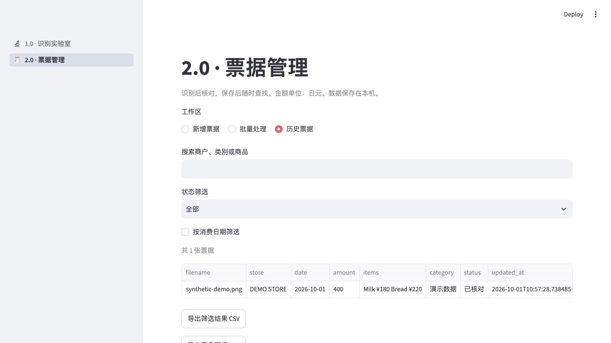
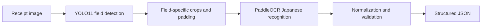
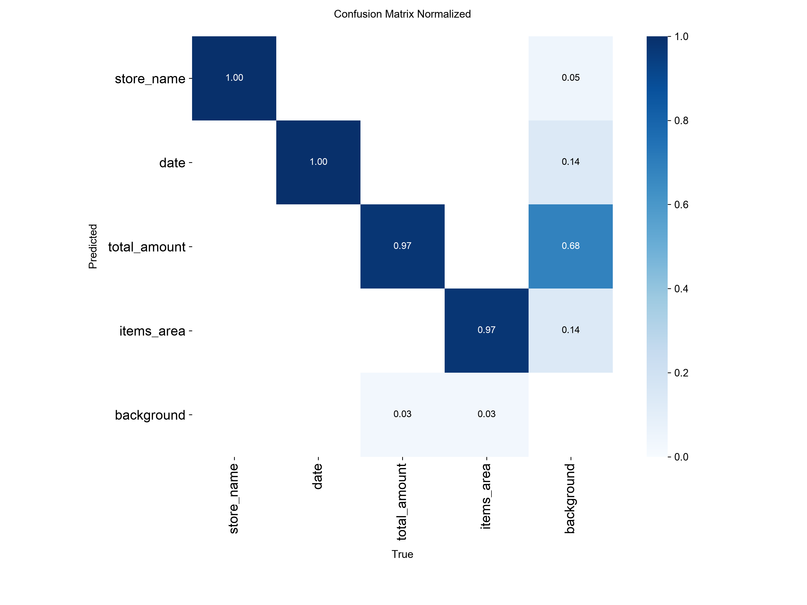
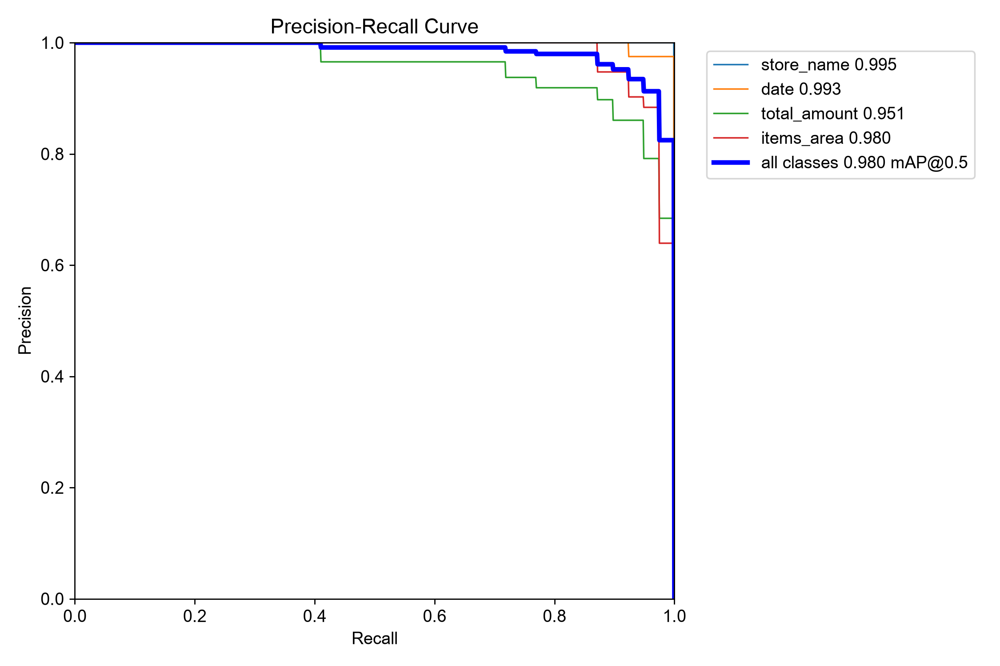
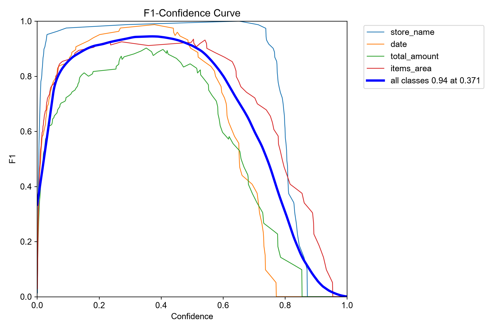
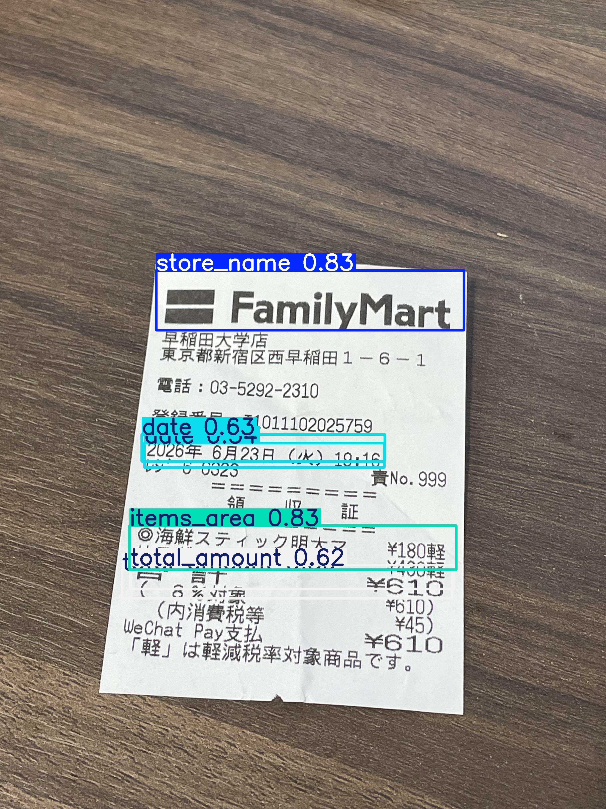
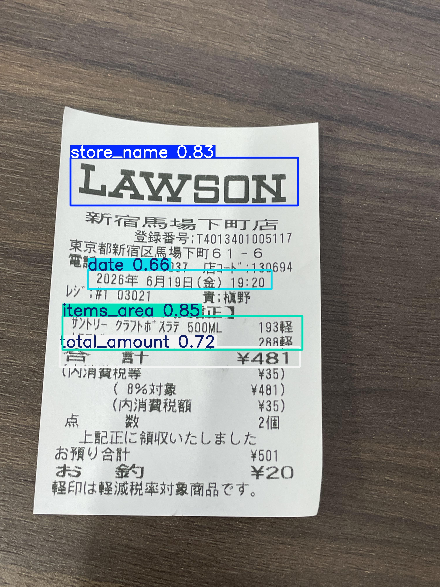
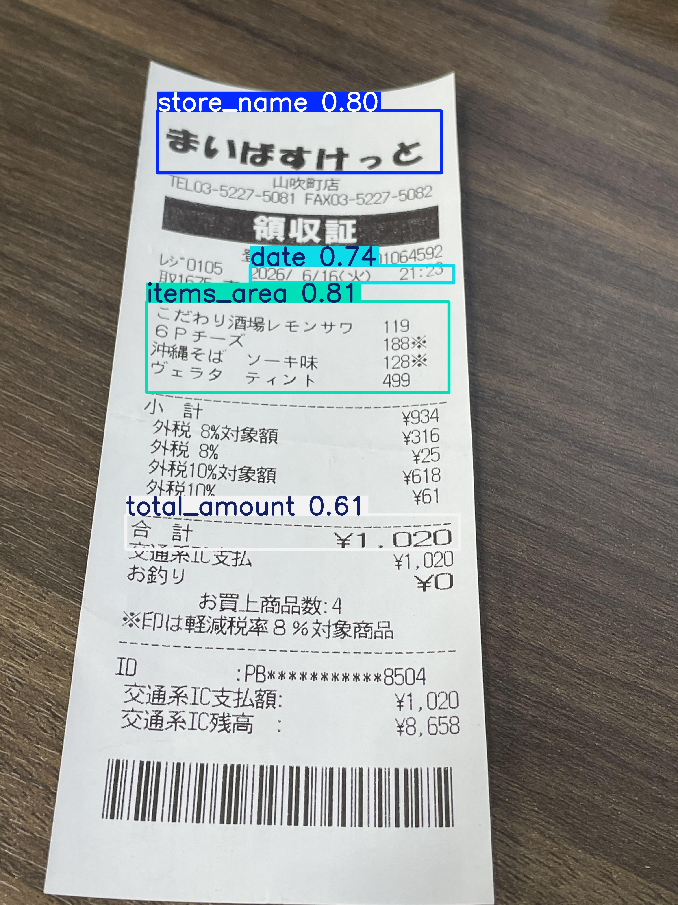

# Japanese Receipt Intelligence 2.0 — YOLO11, OCR & Multimodal Review

[English](README.md) | [日本語](README.ja.md)

A local AI application for Japanese receipts: YOLO11 detects fields, PaddleOCR reads them, and an optional image model helps review uncertain merchant/date/total values before saving, searching and CSV export. The original 1.0 recognition laboratory and detector results are preserved.

## 2.0 — local receipt manager (MVP)

The original recognition laboratory remains available in the sidebar. The new default
page adds a local workflow: upload → recognize → review → save → search → CSV export.
Both pages share the same recognition pipeline. Editing and navigation reuse the
last successful recognition in the current session; they do not rerun OCR.

- **1.0 · 识别实验室**: source image, detection boxes, field crops, OCR and JSON export.
- **2.0 · 票据管理**: editable merchant/date/JPY total/items/category, review status,
  date and text filters, and CSV export of the filtered results.
- Original uploaded image bytes, raw OCR candidates, corrected values and change history
  are stored together in SQLite. Identical image bytes cannot be saved twice; this
  does not detect different photos of the same physical receipt.
- Missing fields may be saved as pending review. Reviewed receipts require a merchant,
  valid date and integer JPY amount. These checks do not guarantee OCR correctness.
- Storage defaults to `.receipt_library/receipts.sqlite3` (Git-ignored). Set
  `RECEIPT_LIBRARY_DIR` to choose another local directory. Back up this directory
  while the app is stopped; it contains the original images and review history.

Run with the existing command: `streamlit run streamlit_app.py`. This is a local,
single-user application; authentication, cloud sync and OCR accuracy benchmarking remain future work. A conservative
item parser now proposes name/line-total pairs; quantities, unit prices, discounts
and tax rates are not inferred. Existing evaluation metrics below are
**1.0 detector results**, not new 2.0 OCR accuracy claims.

The original implementation is preserved at commit `1135fa1` and tag
`v1.0-baseline-1135fa1`. The 2.0 release is tagged `v2.0.0`; model weights remain in the existing `v1.0.0` release.
See [release notes and validation](docs/releases/v2.0.0.md) and the [walkthrough](docs/manager-walkthrough.md).

Validation: `python -m unittest discover -s tests -v` covers field parsing,
persistence, duplicate prevention, stale-edit rejection, audit history, CSV escaping,
and the Streamlit review/save/edit/reopen workflow without rerunning inference.

### Date extraction recovery

Date crops bypass whole-document orientation classification and unwarping; other
fields keep their existing OCR behavior. On a selected set of 39 previously failed
date crops (23 physical receipts), this configuration recovered 39 dates matching
Codex visual readings. These labels are not independently verified and the sample
is not a held-out accuracy benchmark. See the [diagnostic](docs/date-crop-diagnostic.md).

Date parsing accepts fullwidth text and common OCR separator substitutions while
requiring a complete four-digit year. It returns no candidate for invalid dates,
truncated years or multiple distinct dates. It never guesses missing year digits.
If the date remains absent and a date crop exists, the local pipeline tries one
contrast-enhanced/upscaled crop. Initial OCR is retained in `date_raw`; retry text,
candidate and source are recorded separately in `date_recovery`. Retry failures
leave the receipt available for review. Enhanced candidates always require date
review, even when their format is valid. No whole-image date selection is attempted.

### Conditional multimodal review — optional image API

The manager now shows a versioned quality check for missing/invalid fields,
conflicting totals in merchant/date/total only. Item pairing, missing item text
and item-total differences are advisory and never trigger model review. Original OCR, crop coordinates and
routing reasons are preserved. An optional image-capable Chat Completions adapter
can now be configured locally. The manager sends a request only when you click
**让 AI 辅助核对**, only for flagged core fields. Suggestions remain separate from
OCR and manual edits. A durable SQLite record prevents automatic duplicate requests, including after
restarts. Failed calls can be explicitly retried, with a fee notice and a maximum
of three total attempts per image by default; prior attempts remain in history.
A maintenance-only, explicitly authorized fourth attempt is supported after credential correction. Usage, latency and optional cost estimates
are recorded. **Live calls with Alibaba Cloud Qwen `qwen3-vl-plus` recovered the missing totals
on two selected development receipts (129 and 135 JPY), followed by manual entry
and saving. This is a workflow smoke test, not a held-out accuracy benchmark.** See [setup and limitations](docs/multimodal-setup.md).
Total differences alone are advisory.

See [hybrid recognition and evaluation](docs/hybrid-recognition.md) for annotation
commands, metrics and limitations. An unreviewed manifest never produces an accuracy
claim. Under rules 1.1, 57/102 historical outputs trigger review (previously 97/102
when item pairing was included). These are routing counts, not accuracy or proven
cost savings.

### Current validation (2026-10-03)

- **51 automated tests** cover parsing, recovery routing, API response validation,
  network failures, explicit retry history, storage and the Streamlit save/reopen flow.
- On 17 development photos, local changes improved merchant/date/total agreement
  with Codex visual references from **6/17 to 15/17**. References are not independently
  verified; these photos were used for debugging.
- Two selected local-OCR failures were checked through the live image API. Returned
  totals matched the visual references and were saved through the editor; both
  records remain **pending review** in the database.
- The two successful requests reported **6,035 total tokens**, with latency of about
  **80 and 52 seconds**. Failed-request usage and actual bill charges are unknown.
  No overall multimodal accuracy or proven cost-saving claim is made.

See [validation details](docs/validation-v2.md). The existing demo animation and
1.0 detector metrics are retained; the animation does not demonstrate the latest
multimodal review flow.

### Batch processing

The manager's **批量处理** workspace accepts up to 10 distinct images per queue,
each at most 10 MB. Add images to the queue and start recognition. Processing is
sequential; one failed image does not stop the remaining images. Retry buttons only
rerun the selected failed image. Successful results can be reviewed individually or
saved together as **pending review**; bulk save never marks receipts reviewed.

Identical uploaded bytes are deduplicated within a queue and against the saved library.
Storage errors keep successful recognition results available for another save attempt.
The queue is session-local: save results before refreshing or closing the browser.
Clearing the queue discards unsaved results but does not delete saved receipts.

### Item review and reconciliation

The manager includes an editable item table (name and line total in integer JPY).
It proposes candidates from unambiguous name/price sequences and inline currency
amounts. Grouped names/prices and unsupported lines are shown for manual review.
Tax, payment and discount rows are not automatically included. Raw OCR text is
retained, and existing receipts without item rows can still be opened and edited.

The page compares the sum of entered item totals with the receipt total. A difference
is advisory: it can come from missing items, taxes, discounts or OCR errors. A match
does not establish correct item pairing. Saving updates the comparison; changes to
the text do not regenerate the editable table. Users may add, correct or remove rows.
The filtered library exports both receipt CSV (item rows encoded as JSON) and a separate
item CSV with one row per item and its receipt review status. Audit history includes
item edits. This feature has **not** been evaluated against item-level ground truth.

## 2.0 manager preview



Synthetic demonstration record; this screenshot illustrates the UI, not OCR accuracy.

## Original 1.0 recognition demo


The demo covers receipt upload, field detection, region cropping, Japanese OCR, normalization, and JSON export.

## Why this project matters

Whole-image OCR is often unstable on receipts because text is small, layouts vary by store, and photos may be tilted or noisy. This pipeline first finds the business-critical regions and then applies field-specific OCR and validation.


```mermaid
flowchart LR
    A["Receipt image"] --> B["YOLO11 field detection"]
    B --> C["Field-specific crops and padding"]
    C --> D["PaddleOCR Japanese recognition"]
    D --> E["Normalization and validation"]
    E --> F["Structured JSON"]
```

Detected fields: `store_name`, `date`, `total_amount`, and `items_area`.

## Evaluation

The detector was trained for 80 epochs at 640 px using a custom dataset. All photos of the same physical receipt are kept in the same split to prevent near-duplicate leakage. The reported validation split contains 8 physical receipts and 23 images.

| Metric | Validation result |
|---|---:|
| Precision | 0.903 |
| Recall | 0.913 |
| mAP50 | 0.892 |
| mAP50–95 | 0.523 |

The gap between mAP50 and mAP50–95 shows that field presence is detected reliably, while tight box localization remains the main detection improvement area. OCR accuracy is not yet reported because the project does not have a field-level OCR ground-truth set; qualitative examples are not presented as a substitute for that metric.



<details>
<summary>Additional evaluation plots and predictions</summary>





| FamilyMart | LAWSON | MyBasket |
|---|---|---|
|  |  |  |

</details>

## Dataset and evaluation protocol

| Item | Value |
|---|---:|
| Physical receipts | 65 |
| Images | 193 |
| Views per receipt | Up to 3 |
| Store chains | 4 |
| Detection classes | 4 |
| Annotation | Manual bounding boxes |

The data covers FamilyMart, LAWSON, 7-Eleven, and MyBasket receipts photographed under varied angles and positions. `src/split_yolo_dataset_by_receipt.py` groups images by physical receipt and stratifies by store before creating train/validation/test splits. Raw receipt images are excluded from GitHub because they may contain personal or transactional information.

## Quick start

Python 3.11 or 3.12 is recommended.

```bash
git clone https://github.com/taojiangyz/receipt-yolo11-ocr.git
cd receipt-yolo11-ocr
python -m venv .venv
source .venv/bin/activate
pip install -r requirements.txt
python download_model.py
streamlit run streamlit_app.py
```

The verified downloader stores the weight at `models/best.pt`. To use another weight:

```bash
RECEIPT_MODEL_PATH=/path/to/best.pt streamlit run streamlit_app.py
```

## Structured output

```json
{
  "image_id": "family_002_c",
  "ocr_engine": "PaddleOCR",
  "store_name_raw": "FamilyMart",
  "store_name_candidate": "FamilyMart",
  "date_raw": "2026年6月23日（火）19:16",
  "date_candidate": "2026-06-23",
  "total_amount_raw": "¥610\n合計",
  "total_amount_candidate": "610",
  "items_text": "海鮮スティック明太マ\n¥180軽\nサラダチキンロール\n¥430軽"
}
```

The JSON retains raw item text. The 2.0 manager separately proposes conservative
name/line-total pairs for review; quantity, unit price, discount and tax-category
inference remain outside the current scope.

## Engineering decisions

| Problem | Decision |
|---|---|
| Near-duplicate data leakage | Split by physical receipt, not individual photo |
| Partial amount crops | Add larger right/bottom padding for `total_amount` |
| Japanese OCR instability | Compare EasyOCR, Tesseract, and PaddleOCR; use PaddleOCR for the MVP |
| PyTorch/Paddle runtime conflict | Run YOLO first and initialize PaddleOCR lazily |
| High-risk wrong totals | Prefer an empty candidate over an unvalidated value |
| Reproducibility | Publish dependencies, checksum-verified weights, split code, metrics, and demo |

## Limitations and next steps

- Only 65 physical receipts; broader store, device, lighting, and layout coverage is needed.
- OCR has qualitative validation but no labeled field-level accuracy benchmark yet.
- Total extraction uses conservative rules and still needs confidence calibration.
- Date crops skip document preprocessing; difficult rotations and unreadable photos may still need manual correction.
- Item pairing is conservative and has no item-level accuracy benchmark.
- Multimodal routing is implemented; external model calls are not connected.
- The Streamlit app is a local prototype without authentication, monitoring, or cloud deployment.

The next evaluation milestone is a receipt-grouped held-out test set with field exact match, character error rate, total-amount accuracy, and end-to-end latency.

## Repository layout

```text
streamlit_app.py                 Two-page application
pages/lab.py                    Original recognition laboratory
pages/manager.py                Receipt review and library
src/receipt_pipeline.py         Shared detection/OCR pipeline
src/receipt_store.py            SQLite originals, corrections and history
src/receipt_quality.py          Core-field review routing
tests/                          Automated regression checks
download_model.py               Verified model download
src/split_yolo_dataset_by_receipt.py
src/predict_and_crop.py         Detection and crop CLI
src/ocr_receipt_paddle.py       OCR and JSON pipeline
assets/demo/                    Product demonstration
assets/evaluation/              Evaluation artifacts
```

## License

Source code is available under the [MIT License](LICENSE). Model weights are provided for portfolio and research demonstration. Raw receipt data and third-party trademarks are not covered by the software license.
