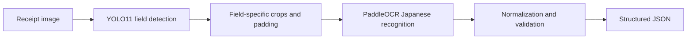

# Japanese Receipt Intelligence — YOLO11 + PaddleOCR

[English](README.md) | [日本語](README.ja.md)

An end-to-end document AI prototype that detects key fields in Japanese convenience-store receipts, applies OCR only to the detected regions, and returns structured JSON.

## 2.0 — local receipt manager (development)

The original recognition laboratory remains available in the sidebar. The new default
page adds a local workflow: upload → recognize → review → save → search → CSV export.
Both pages share the same recognition pipeline. Editing and navigation reuse the
last successful recognition in the current session; they do not rerun OCR.

- **1.0 · 识别实验室**: source image, detection boxes, field crops, OCR and JSON export.
- **2.0 · 票据管理**: editable merchant/date/JPY total/items/category, review status,
  date and text filters, and CSV export of the filtered results.
- Original uploaded image bytes, raw OCR candidates, corrected values and change history
  are stored together in SQLite. Identical image bytes cannot be saved twice; this
  does not detect different photos of the same physical receipt.
- Missing fields may be saved as pending review. Reviewed receipts require a merchant,
  valid date and integer JPY amount. These checks do not guarantee OCR correctness.
- Storage defaults to `.receipt_library/receipts.sqlite3` (Git-ignored). Set
  `RECEIPT_LIBRARY_DIR` to choose another local directory. Back up this directory
  while the app is stopped; it contains the original images and review history.

Run with the existing command: `streamlit run streamlit_app.py`. This is a local,
single-user application; authentication, cloud sync, item-level parsing and OCR
accuracy benchmarking remain future work. Existing evaluation metrics below are
**1.0 detector results**, not new 2.0 OCR accuracy claims.

The original implementation is preserved at commit `1135fa1` and local tag
`v1.0-baseline-1135fa1`. The 2.0 development branch is `feature/receipt-manager-v2`.

Validation: `python -m unittest discover -s tests -v` covers field parsing,
persistence, duplicate prevention, stale-edit rejection, audit history, CSV escaping,
and the Streamlit review/save/edit/reopen workflow without rerunning inference.

## Product demo


The demo covers receipt upload, field detection, region cropping, Japanese OCR, normalization, and JSON export.

## Why this project matters

Whole-image OCR is often unstable on receipts because text is small, layouts vary by store, and photos may be tilted or noisy. This pipeline first finds the business-critical regions and then applies field-specific OCR and validation.


```mermaid
flowchart LR
    A["Receipt image"] --> B["YOLO11 field detection"]
    B --> C["Field-specific crops and padding"]
    C --> D["PaddleOCR Japanese recognition"]
    D --> E["Normalization and validation"]
    E --> F["Structured JSON"]
```

Detected fields: `store_name`, `date`, `total_amount`, and `items_area`.

## Evaluation

The detector was trained for 80 epochs at 640 px using a custom dataset. All photos of the same physical receipt are kept in the same split to prevent near-duplicate leakage. The reported validation split contains 8 physical receipts and 23 images.

| Metric | Validation result |
|---|---:|
| Precision | 0.903 |
| Recall | 0.913 |
| mAP50 | 0.892 |
| mAP50–95 | 0.523 |

The gap between mAP50 and mAP50–95 shows that field presence is detected reliably, while tight box localization remains the main detection improvement area. OCR accuracy is not yet reported because the project does not have a field-level OCR ground-truth set; qualitative examples are not presented as a substitute for that metric.


<details>
<summary>Additional evaluation plots and predictions</summary>


| FamilyMart | LAWSON | MyBasket |
|---|---|---|
|  |  |  |

</details>

## Dataset and evaluation protocol

| Item | Value |
|---|---:|
| Physical receipts | 65 |
| Images | 193 |
| Views per receipt | Up to 3 |
| Store chains | 4 |
| Detection classes | 4 |
| Annotation | Manual bounding boxes |

The data covers FamilyMart, LAWSON, 7-Eleven, and MyBasket receipts photographed under varied angles and positions. `src/split_yolo_dataset_by_receipt.py` groups images by physical receipt and stratifies by store before creating train/validation/test splits. Raw receipt images are excluded from GitHub because they may contain personal or transactional information.

## Quick start

Python 3.11 or 3.12 is recommended.

```bash
git clone https://github.com/taojiangyz/receipt-yolo11-ocr.git
cd receipt-yolo11-ocr
python -m venv .venv
source .venv/bin/activate
pip install -r requirements.txt
python download_model.py
streamlit run streamlit_app.py
```

The verified downloader stores the weight at `models/best.pt`. To use another weight:

```bash
RECEIPT_MODEL_PATH=/path/to/best.pt streamlit run streamlit_app.py
```

## Structured output

```json
{
  "image_id": "family_002_c",
  "ocr_engine": "PaddleOCR",
  "store_name_raw": "FamilyMart",
  "store_name_candidate": "FamilyMart",
  "date_raw": "2026年6月23日（火）19:16",
  "date_candidate": "2026-06-23",
  "total_amount_raw": "¥610\n合計",
  "total_amount_candidate": "610",
  "items_text": "海鮮スティック明太マ\n¥180軽\nサラダチキンロール\n¥430軽"
}
```

`items_area` remains raw OCR text in the MVP. Product-level parsing into name, quantity, unit price, discount, and tax category is outside the current scope.

## Engineering decisions

| Problem | Decision |
|---|---|
| Near-duplicate data leakage | Split by physical receipt, not individual photo |
| Partial amount crops | Add larger right/bottom padding for `total_amount` |
| Japanese OCR instability | Compare EasyOCR, Tesseract, and PaddleOCR; use PaddleOCR for the MVP |
| PyTorch/Paddle runtime conflict | Run YOLO first and initialize PaddleOCR lazily |
| High-risk wrong totals | Prefer an empty candidate over an unvalidated value |
| Reproducibility | Publish dependencies, checksum-verified weights, split code, metrics, and demo |

## Limitations and next steps

- Only 65 physical receipts; broader store, device, lighting, and layout coverage is needed.
- OCR has qualitative validation but no labeled field-level accuracy benchmark yet.
- Total extraction uses conservative rules and still needs confidence calibration.
- Tilt correction and item-level parsing are not implemented.
- The Streamlit app is a local prototype without authentication, monitoring, or cloud deployment.

The next evaluation milestone is a receipt-grouped held-out test set with field exact match, character error rate, total-amount accuracy, and end-to-end latency.

## Repository layout

```text
streamlit_app.py                 End-to-end demo
download_model.py               Verified model download
src/split_yolo_dataset_by_receipt.py
src/predict_and_crop.py         Detection and crop CLI
src/ocr_receipt_paddle.py       OCR and JSON pipeline
assets/demo/                    Product demonstration
assets/evaluation/              Evaluation artifacts
```

## License

Source code is available under the [MIT License](LICENSE). Model weights are provided for portfolio and research demonstration. Raw receipt data and third-party trademarks are not covered by the software license.
