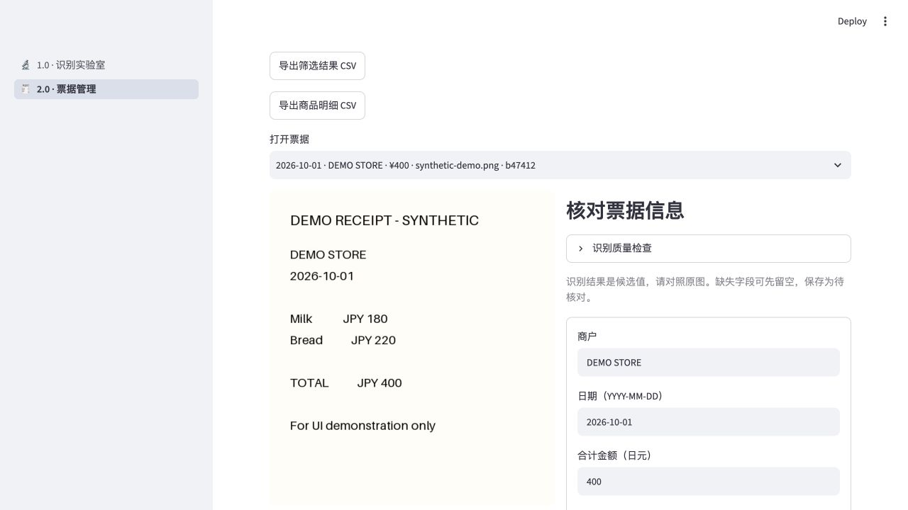

# Receipt manager 2.0 walkthrough

Start with `streamlit run streamlit_app.py`. The interface currently uses Chinese
labels; the following steps match the displayed controls. The screenshot record is
synthetic demonstration data, seeded for UI illustration, not an OCR accuracy example.

## Upload and review

1. Select **2.0 · 票据管理 → 新增票据** and upload a JPG or PNG receipt.
2. Click **识别小票**. First use may download OCR models and take longer.
3. Compare **商户** (merchant), **日期** (date) and **合计金额** (JPY total)
   against the original image. Dates use `YYYY-MM-DD`; totals use integer yen.
4. Correct missing or incorrect fields. Optional item rows and category can also
   be edited. Item differences do not trigger the future multimodal route.
5. Choose **待核对** (pending) if uncertain, or **已核对** (reviewed) after
   confirming the three core fields. Click **保存票据**.

The quality panel describes original OCR evidence. Passing rules does not mean the
values are correct, and the panel can continue to flag original OCR after manual
correction. No external multimodal request is made in this release.

## Find, edit and export

1. Open **历史票据**. Search merchant, category or item text; optionally filter
   by review status and transaction date.
2. Select a saved receipt with **打开票据**, edit its fields and save.
   **保存与修改记录** shows the audit trail; original image/OCR remain preserved.
3. Use **导出筛选结果 CSV** for filtered receipt rows or **导出商品明细 CSV**
   for item rows. CSV exports retain each receipt's review status.

## Batch and original laboratory

**批量处理** accepts at most 10 distinct images, each at most 10 MB. Recognition
runs sequentially. Retry only failed images, review successful ones individually,
or save successes together as pending review. Save before closing the browser;
the unsaved queue is session-local. Identical file bytes are deduplicated; different
photos of the same receipt are not automatically merged.

**1.0 · 识别实验室** retains detection overlays, field crops, raw OCR and JSON
export. The manager can use the current session's laboratory recognition result.

## Existing installations

The database location remains `.receipt_library/receipts.sqlite3`. Set
`RECEIPT_LIBRARY_DIR` to use another location. Stop the app before backing up this
directory. Existing records remain readable, including records without item rows.
Restart Streamlit after updating code so cached model resources reload.

Saved OCR is not rewritten by the date fix. Correct historical records through
**历史票据**, or inspect the original image again in the laboratory. Saving the same
image twice is blocked. No external API key is required; cloud sync and multi-user
hosting are outside this local MVP.
